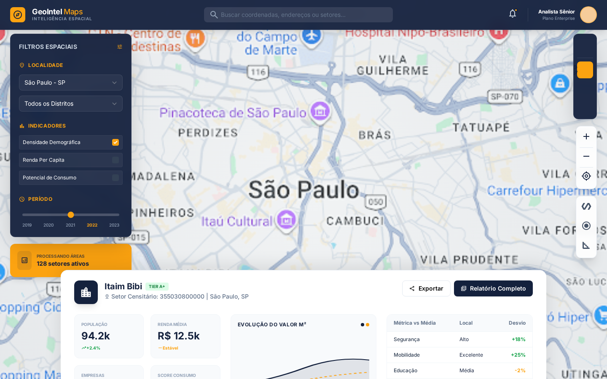
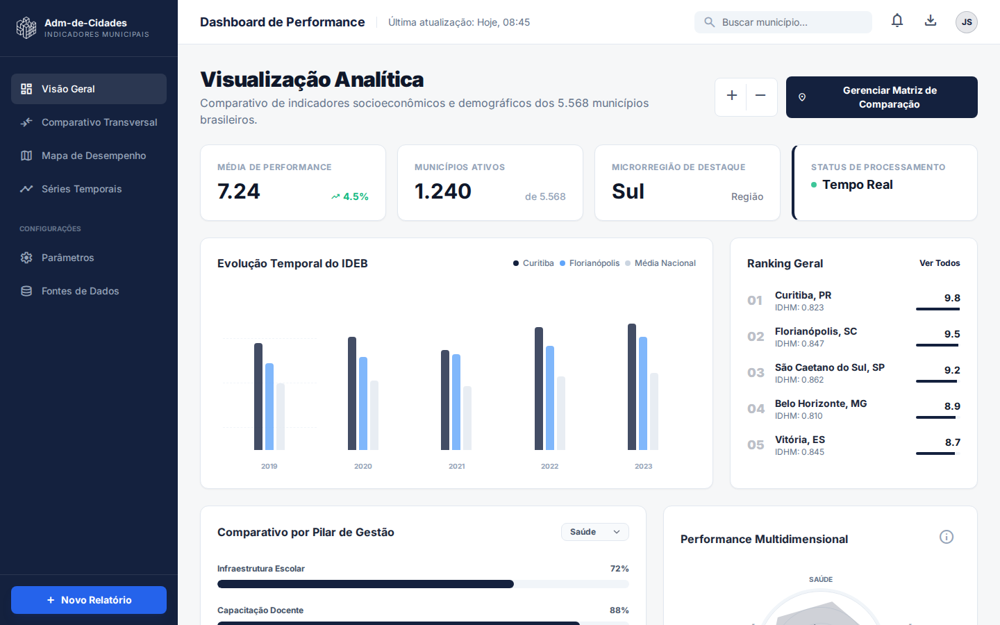
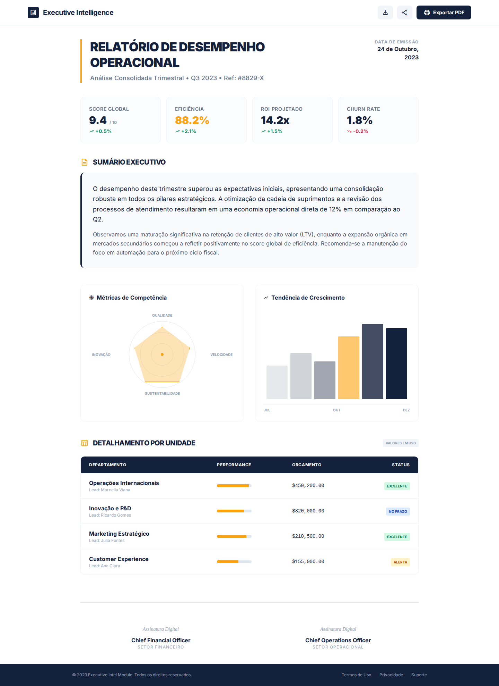
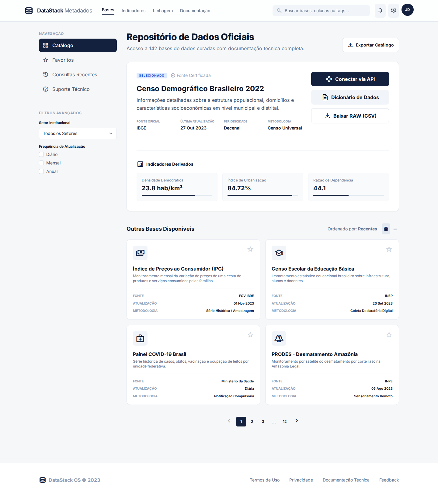
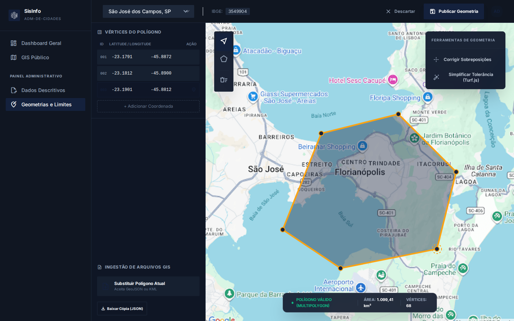
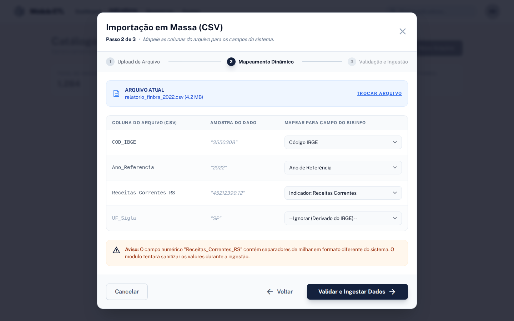
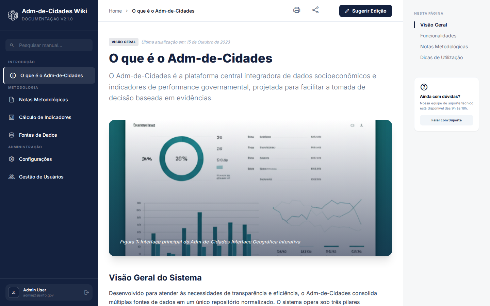

# 2. Identidade Visual, Design System e UI/UX

**Plataforma: SisInfo / GeoIntel (Inteligência Territorial e Analítica)**

---

## 2. Identidade Visual e Design System

O design deve transmitir credibilidade, rigor analítico e modernidade, com uma estética sóbria e profissional (padrão de ferramentas institucionais e painéis executivos).

### Paleta de Cores Estrita:

*   **`#14213d` (Azul Marinho Profundo):** Cor primária. Usada para o mapa de fundo, barras de navegação, títulos e elementos de peso.
*   **`#fca311` (Laranja/Dourado):** Cor de destaque (Accent). Usada para botões de ação principal (CTAs), alertas, marcadores ativos no mapa e linhas de tendência em gráficos.
*   **`#000000` (Preto):** Textos principais de alto contraste e sombras profundas.
*   **`#e5e5e5` (Cinza Claro):** Divisórias, bordas sutis e fundos de painéis secundários.
*   **`#ffffff` (Branco):** Fundos de cards, painéis flutuantes (glassmorphism leve) e textos sobre a cor primária.

### Tipografia e Estilo

*   **Tipografia:** Família *Inter* (ou similar sem serifa, limpa e legível). Peso forte (Bold/Black) para números de KPIs e títulos; peso regular para leitura de dados.
*   **Acessibilidade (Mapas):** Escalas de cores para mapas coropléticos devem utilizar paletas *colorblind-safe* (ex: Viridis, Cividis) calculadas pelo D3.js.
*   **Estilo de UI:** Uso inteligente de *White Space*, bordas arredondadas moderadas (`rounded-xl` a `rounded-3xl`), e painéis flutuantes sobre o mapa com efeito de desfoque (`backdrop-blur` / *glassmorphism*).

---

## 4. Detalhamento dos Módulos (Escopo e UI/UX das Telas)

A aplicação é dividida em submódulos interligados. Abaixo, detalhamos o layout, comportamento e componentes exigidos para cada tela, baseando-se nos protótipos ideais da plataforma.

### 4.1. Módulo de Inteligência Espacial (O Core Map)

A porta de entrada do sistema. Foco puramente geográfico e imersivo.

*   **Layout Base:** O mapa (Mapbox/MapLibre) ocupa 100% da viewport, com estilo escuro/topográfico ou limpo (light), criando um fundo imersivo. Não há sidebars fixas pesadas que limitem o mapa.
*   **Header / Top Bar:** Barra superior fixa, semitransparente (backdrop-blur). Contém o logo, menu sanduíche (que abre um Full-menu Drawer), barra de pesquisa rápida ("Buscar coordenadas, endereços ou setores...") e perfil do usuário.
*   **Painel de Filtros (Floating Left UI):**
    *   Painel lateral esquerdo flutuante (estilo Glass panel com blur), que pode ser recolhido.
    *   **Localidade:** Selectors para Estado, Município e Zona.
    *   **Indicadores Principais (Grid):** Botões em formato de grid (2x2) para seleção rápida do indicador a colorir o mapa (ex: PIB, População, IDHM, Risco).
    *   **Linha do Tempo (Slider):** Um controle deslizante horizontal (range input) destacando o ano selecionado (ex: 2010 a 2024), alterando dinamicamente os dados do mapa.
    *   **Camadas Visíveis:** Toggles (switches) para ligar/desligar "Limites Municipais", "Densidade Demográfica", etc.
*   **Controles de Mapa (Floating Right UI):** Botões empilhados à direita para Zoom In/Out, Minha Localização e Alternância de Estilo de Mapa (Satélite, Vetor 3D).
*   **Interação de Detalhamento (Bottom Sheet):**
    *   Ao clicar em uma localidade no mapa, o sistema não muda de página.
    *   Um painel (Bottom Sheet) emerge da base da tela (animado, `translate-y-0`), ocupando parte da tela.
    *   **Conteúdo do Bottom Sheet:**
        *   Cabeçalho com o Nome da Cidade, tag de tier (ex: "Região Metropolitana") e botão de salvar/favoritar.
        *   **KPI Cards:** Exibem valores absolutos (ex: PIB R$ 716B) ao lado de barras de progresso horizontais embutidas no próprio card.
        *   **Benchmarking Regional:** Tabela simplificada mostrando Indicador, Valor Atual, Projeção e Ícone de Tendência (setas verdes/vermelhas), comparando a localidade selecionada com a média estadual.
        *   **Botões de ação primária:** "Relatório Completo" (Leva ao Módulo 3) e "Comparar" (Adiciona ao Dock do Módulo 2).

---

### 4.2. Módulo de Visualização Analítica (Dashboard de Indicadores)

Foco estatístico, cruzamento de dados e análise temporal. O mapa sai de cena.

*   **Layout Base:** Fundo cinza claro/off-white (`#f4f3f3`), estrutura baseada em cards arredondados (Bento Box Grid). Menu lateral fixo à esquerda.
*   **KPI Ribbon (Top Row):** 4 cartões superiores exibindo as médias globais dos indicadores (ex: Global Health Index, Education Access). Cada card possui um ícone temático, o valor em destaque (tipografia pesada) e um badge de variação (ex: +12.4% em fundo verde).
*   **Grid Analítico Principal:**
    *   **Performance Over Time (Área/Linha):** Gráfico principal ocupando grande parte do topo. Utiliza visualização de área com gradientes transparentes que descem das linhas de tendência até a base. Controles para alterar agrupamento (Mensal, Trimestral, 12 Meses).
    *   **Top Performing Localities (Ranking):** Card listando os municípios/distritos em formato de ranking numérico (01, 02, 03...). Cada linha exibe o nome, pontuação e uma barra de progresso horizontal (`bg-green-500` ou `bg-amber-500` dependendo da performance).
    *   **Comparativo Setorial (Barras Horizontais):** Gráfico comparando duas dimensões (ex: Saúde vs Educação) para diferentes distritos. Utiliza barras duplas alinhadas.
    *   **Performance Multidimensional (Radar/Hexagonal):** Componente visual centralizando um gráfico de radar (ou representação geométrica customizada) para demonstrar a distribuição do perfil da cidade (Finanças, Saúde, Segurança, Educação).
*   **Dock Dinâmico de Comparação (Bottom Fixed):**
    *   Uma barra fixa na parte inferior da tela (glassmorphism).
    *   Funciona como um "carrinho" de comparação. Exibe chips com o nome das cidades adicionadas (com botão 'x' para remover).
    *   Botão "+ Compare with..." para abrir a busca e adicionar locais.
    *   Botão principal: "Generate Analysis" (Atualiza os gráficos do dashboard cruzando todas as cidades do Dock).

---

### 4.3. Gerador de Perfis e Relatórios (Dossiê Executivo)

Foco em leitura, compilação de dossiês formais e impressão.

*   **Layout Base (Página A4):** O contêiner principal simula uma folha de papel física (width: 210mm, fundo branco puro, sombra ao redor, centralizada na tela). O fundo do site fora do "papel" é cinza.
*   **Design para Impressão (`@media print`):** A página possui CSS específico para ocultar navegação, menus flutuantes, e remover sombras da "folha", permitindo salvar em PDF ou imprimir com perfeição.
*   **Estrutura do Documento:**
    *   **Cabeçalho Corporativo:** Logotipo, título formal ("Relatório Executivo de Inteligência Geográfica"), Data de Emissão e Código de Referência (Hash único).
    *   **Sumário Executivo:** Bloco de texto justificado com uma borda lateral grossa (cor primária), contendo um resumo descritivo gerado sobre a situação da localidade.
    *   **Grid de KPIs Simples:** Quadrados minimalistas com bordas sutis. Exibem Título, Valor absoluto (ex: 4,829) e variação percentual.
    *   **Visualizações Gráficas Estáticas:** Gráficos simplificados (sem tooltips ou interações complexas), como um Radar Chart limpo e um Gráfico de Linhas/Barras para o histórico dos últimos 6 meses.
    *   **Tabela de Detalhamento:** Tabela zebrada listando sub-regiões ou pilares orçamentários, com formatação clara para status (ex: badges "NOMINAL", "ALERTA", "CRÍTICO").
    *   **Rodapé e Assinaturas:** Espaço delimitado no fim da página para assinaturas de analistas (com linha, nome e cargo), selo de segurança digital e numeração de página.
*   **Ações Flutuantes (Non-printable):** Botões fixos no canto inferior direito da tela (fora da "folha") para "Exportar PDF", "Imprimir Relatório" e "Compartilhar".

---

### 4.4. Repositório de Bases e Metadados (Data Catalog)

Catálogo de transparência e governança do DataStack.

*   **Layout Base:** Header minimalista com campo central de busca ampla. Barra lateral esquerda com links rápidos (Catálogo, Favoritos) e Filtros Avançados (Setor Institucional, Frequência de Atualização).
*   **Lista de Bases (Cards):** Os datasets são exibidos em formato grid. Cada card exibe: Ícone do setor, Título da Base (ex: "Censo Demográfico"), descrição curta e três linhas de metadados: Fonte (IBGE), Atualização e Metodologia.
*   **Visão de Detalhe (Ao selecionar um Dataset):**
    *   O topo exibe um banner de destaque.
    *   Coluna central detalha o dataset, a metodologia e exibe cards menores dos "Indicadores Derivados" dessa base (ex: Densidade Demográfica, Índice de Urbanização) com uma pequena barra representativa do dado.
    *   Coluna lateral de Ações: Botões robustos para "Conectar via API", "Dicionário de Dados" e "Baixar RAW (CSV)".

---

### 4.5. Módulo de Administração: City Editor & Bulk Import (ETL UI)

Ambiente restrito a administradores (RBAC) para curadoria manual e importação de dados.

*   **Layout do City Editor:**
    *   Abas de navegação internas: *General Info*, *Geometry Editor*, *Indicators*.
    *   **General Info:** Formulários padronizados para editar metadados primários do município (Nome, IBGE, Região, Área).
    *   **Geometry Editor:** Split screen. Lado esquerdo exibe uma lista de vértices (Latitude/Longitude) editáveis linha a linha. Lado direito exibe um mapa interativo com ferramentas de desenho de polígonos (Turf.js). Botões para importar/exportar GeoJSON daquele município.
    *   **Indicators (Tabela de Séries Temporais):** Interface semelhante a planilha. Colunas para Ano, Valor e Status de Validação. Permite edição in-line dos valores anuais de um indicador e possui um botão de "Adicionar Linha de Ano". Gráfico sparkline acima da tabela refletindo os valores instantaneamente.
*   **Modal de Bulk Import (Importação em Massa):**
    *   Modal centralizado com Stepper progressivo (1. Upload, 2. Map Columns, 3. Validate).
    *   **Tela crítica: Mapeamento de Colunas.** O sistema lista as colunas do CSV inserido e exige que o usuário use um select dropdown para vinculá-las aos campos de sistema obrigatórios (ex: CSV "Numeric_Val" -> Sistema "Valor"). Exibe alertas para colunas não mapeadas ou dados com formatos estranhos.

---

### 4.6. Documentação, Configurações e "Sobre" (Wiki)

Manual do usuário e central de transparência metodológica.

*   **Layout Base:** Típico de documentações técnicas. Sidebar fixa à esquerda com a árvore de diretórios (Introdução, Metodologia, Notas, Administração).
*   **Área de Leitura (Prose):** O centro da tela usa classes otimizadas para leitura tipográfica (ex: `prose` do Tailwind). Textos bem espaçados, headers claramente hierarquizados.
*   **Componentes Ricos:** Inclusão de imagens com legendas (ex: "Figura 1"), caixas de destaque/alertas (ex: "Dica de Utilização" com fundo colorido e ícone de lâmpada) para destacar informações críticas de API ou formatação estatística.
*   **Navegação de Rodapé:** Links rápidos no final da página para o tópico "Anterior" e "Próximo".
*   **Toc Lateral (Table of Contents):** Em telas largas, um painel adicional à direita ("Nesta Página") que acompanha a rolagem, exibindo âncoras para os subtítulos da página atual, acompanhado de um card para "Falar com Suporte".

---
*Este documento serve como guia de design para as equipes de UX/UI e Frontend.*